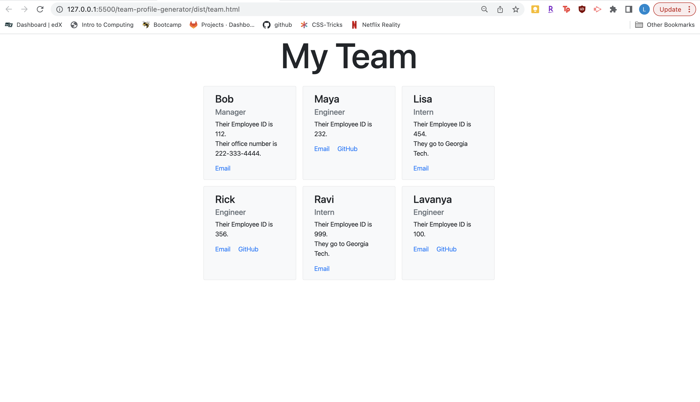

# team-profile-generator
Generate a team profile html using command line prompts

## Description

Users are presented with a list of questions in the terminal to generate a team profile html.

## Usage

You can use this application to generate a website that contains profiles of each of your team members.

## Link to Video Walkthrough

[Video Walkthrough](https://drive.google.com/file/d/1KzWdgFFbSg_g60-IWJCeYFz9H3rOgZ9V/view?usp=sharing)

## Link to Example Generated HTML

[Test Team HTML](./dist/team.html)

## Screenshot of HTML

